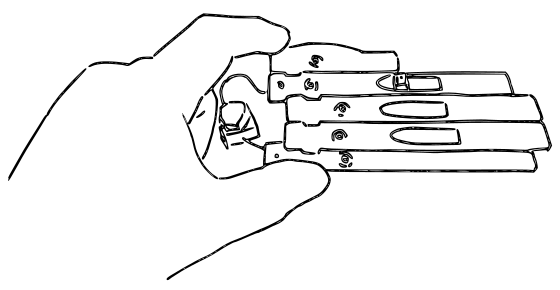
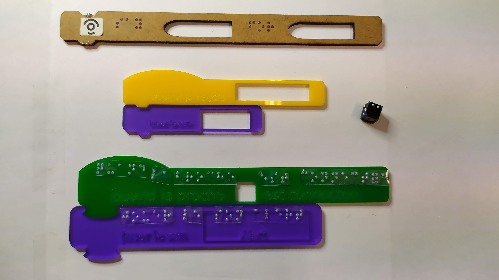

# TaBGO 

## Informations générales
Le projet TaBGO a pour objectif de permettre à des personnes non-voyantes d'utiliser le langage de programmation [Scratch](https://scratch.mit.edu) par utilisation de blocs tangibles.

Le lecteur TaBGo permet la reconnaissance des blocs tangibles grâce à des [TopCodes](https://github.com/truillet/TopCodes) ainsi que des [cubarithmes](https://magasin.avh.asso.fr/tous-les-articles/145-cubes-algebriques-par-100.html?search_query=cube+braille&results=51) et créer un fichier **sb3** directement exécutable par [Scratch](https://scratch.mit.edu).

Vous pouvez consulter la documentation pour construire vos blocs au format **[docx](./documentation/TaBGO_blocs_Scratch.docx)** ou **[pdf](./documentation/TaBGO_blocs_Scratch.pdf)**

Des exemples d'algorithmes sont disponibles *ici* (*à venir*)

Le code disponible **[là](./tabgo)** a principalement été développé au travers de plusieurs projets de fin d'étude : Jean-Baptiste Marco dans sa première mouture en java (stage de 2A ISAE-ENSMA) en 2018, Léa Berquez (stage de L3 Informatique - UT3) en 2020, un pool de 10 étudiants de L3 informatique (TER - UT3) en 2021 et Mathieu Campan (stage de 1A ENSEEIHT) en 2022 et {Ninon Autefage, Noémie Guiraud, Adrian Morellato et Loan Vigouroux (BE de Lience Informatique - UT3)} en 2024.  

D'autres voies sont actuellement explorées pour permettre une exécution complètement non-visuelle du code.

## Technologies utilisées
Le logiciel utilise [processing.org](https://www.processing.org) et les librairies *[OpenCV](./tabgo/code/opencv_processing4.52.jar)* recompilé avec la version OpenCV 4.52, *[Video](https://github.com/processing/processing-video)* (pour la reconnaissance optique),  *[drop](http://transfluxus.github.io/drop)* (pour le Drag and Drop d'images) et *[gson](https://github.com/google/gson)* (pour la création des fichiers **sb3**).
Enfin, une librairie de synthèse vocale en anglais est utilisée pour un feedback sonore (fournie directement).

## Installation (à n'effectuer qu'une fois)
* Téléchargement du logiciel [Processing.org](https://processing.org/download) 4.3
* Importation de la librairie *[Video](https://github.com/processing/processing-video)* 
`Sketch -> Importer une librairie... -> Ajouter une librairie...`
* Les librairies *[gson](https://github.com/google/gson)*, *[OpenCV](./tabgo/code/opencv_processing4.52.jar)*, *Drop* et *TTS* se trouvent dans le sous-dossier **code** et seront chargées automatiquement. Si cela ne fonctionne pas, glissez-déposez les fichiers *.jar* dans la fenêtre Processing lors de l'ouverture du programme.

## Exécution
Après avoir appuyé sur *"lancer le programme Processing"* (bouton *"Play"*), vous pouvez scanner votre environnement de travail et commencer l'exécution du programme en appuyant sur la touche *"espace"*.

Si vous souhaitez effectuer la reconnaissance de code à partir d'une image, appuyez sur la touche *"i"* ou *"I"* et glissez-déposez votre image dans la fenêtre tabgo. Si vous voulez lancer un script de test, appuyez sur *"t*" ou "*T*".

Les fichiers de tests (images **.png**) se trouvent dans le sous-dossier **data**. Modifiez le fichier à tester dans la classe "*tabgo.pde*", dans la méthode "*creation*".
Le fichier **.sb3** obtenu se trouve dans le dossier "**data/sb3/Programme_scratch.sb3**" et peut ensuite être chargé et exécuté sur le site web [Scratch](https://scratch.mit.edu) : 

`Bouton Créer puis menu  File -> Load from your computer`

## Financement
Ce projet a été partiellement financé via un appel à projets de l'[UNADEV](https://www.unadev.com/nos-missions/appel-a-projets) - Financement **2019.49** 

## Publications en lien avec le projet
* Marco J.B., Baptiste-Jessel N., Truillet Ph., *[TaBGO : Programmation par blocs tangibles](https://hal.archives-ouvertes.fr/hal-02181953)* In: 30e Conference francophone sur l'Interaction Homme-Machine (IHM 2018), 23 October 2018 - 26 October 2018 (Brest, France)
* Andriamahery-Ranjalahy K., Berquez L., Jessel N., Truillet Ph., *[TaBGO: towards accessible computer science in secondary school](https://hal.archives-ouvertes.fr/hal-03168307v1)*, In : 23rd International Conference on Human-Computer Interaction (HCI International 2021), Jul 2021, virtual place, United States.
* Andriamahery-Ranjalahy K., Truillet Ph.,  *[Permettre l’autonomie dans l’activité de programmation par blocs pour des enfants non-voyants](https://hal.archives-ouvertes.fr/hal-03716993v1)*, In : 12e Conférence Handicap 2022, 8-10 Juin 2022 (Paris, France), pp. 155-160

## Presse, informations
* [Expérimentation au collège Lamartine / Toulouse - Juin 2021](https://lamartine.ecollege.haute-garonne.fr/le-college/projet-techno-programmation-scratch-pour-les-non-voyants-17099.htm)
* Présentation aux [Journées d'Etudes de l'ATAF](https://transcripteur.fr/actualites/journees-detude-ataf-2024) - Association des Transcripteurs-Adaptateurs Francophones 2024, 21 juin 2024 
